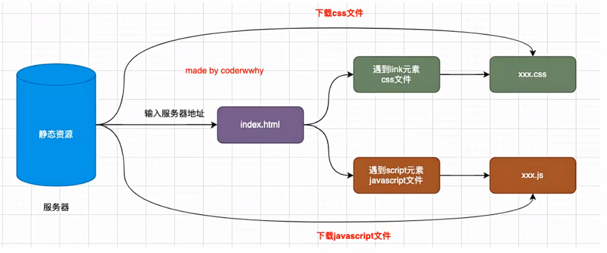
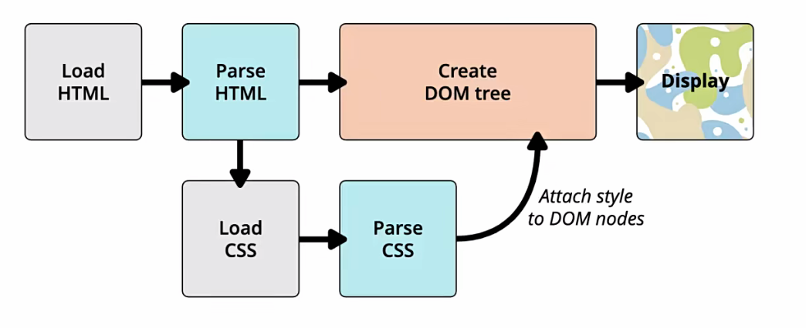
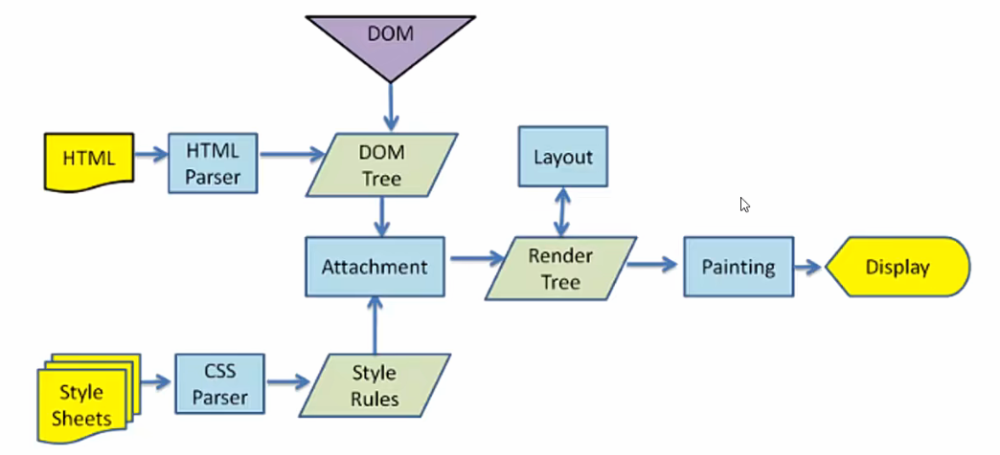
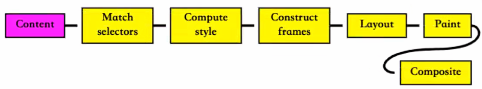

# 浏览器渲染页面的基本流程

## 输入URL后资源的加载过程

## 浏览器的内核

常见的浏览器内核有：

- Trident（三叉戟）：IE、360安全浏览器、搜狗高速浏览器、百度浏览器、UC浏览器
- Gecko（壁虎）：Mozilla Firefox
- Presto（急板乐曲）-> Blink（眨眼）：Opera
- Webkit：Safari、360极速浏览器、搜狗高速浏览器、移动端浏览器（Android、iOS）
- Webkit -> Blink：Google Chrome， Edge

> 我们经常说的浏览器内核指的是浏览器的排版引擎：
>
> - 排版引擎 (layout engine)，也称为浏览器引擎 (browser engine)、页面渲染引擎 (rendering engine)或样板引擎
>
> 也就是一个网页下载下来后，就是由我们的渲染引擎来帮助我们解析的。

## 渲染引擎如何解析页面呢？

简略图：

更详细的解析过程如下：

> 可以拜读文章 https://web.dev/articles/howbrowserswork?hl=zh-cn

### 解析一：HTML解析过程

- 因为默认情况下服务器会给浏览器返回index.html文件，所以解析HTML是所有步骤的开始
- 解析HTML，会构建DOM Tree

### 解析二：生成CSS规则

- 在解析过程中，如果遇到CSS的link元素，那么会由浏览器负责下载对应的CSS文件
  - 注意：下载CSS文件是不会影响DOM的解析的
- 浏览器下载完CSS文件后，就会对CSS文件进行解析，解析出对应的规则树
  - 我们可以称之为CSSOM (CSS Object Model，CSS对象模型)，也会形成树结构
  - DOM (document object model)文件对象模型

### 解析三：构建Render Tree

- 当有了DOM Tree和CSSOM之后，就可以两个结合来构建Render Tree了
- 注意一：link元素不会阻塞DOM Tree的构建过程，但是会阻塞，Render Tree的构建过程
  - 这是因为Render Tree在构建时，需要对应的CSSOM Tree

### 解析四：布局（layout）和绘制（Paint）

- 第四步是在渲染树（Render Tree）上运行布局（layout）以计算每个节点的几何体
  - 渲染树会表示显示哪些节点以及其他样式，但是不表示每个节点的尺寸、位置等信息
  - 布局是确定呈现树中所有节点的宽度、高度和位置信息
- 第五步是将每个节点绘制（Paint）到屏幕上
  - 在绘制阶段，浏览器将布局阶段计算的每个frame转为屏幕上实际的像素点
  - 包括将元素的可见部分进行绘制，比如文本、颜色、边框、阴影、替换元素（比如img）

